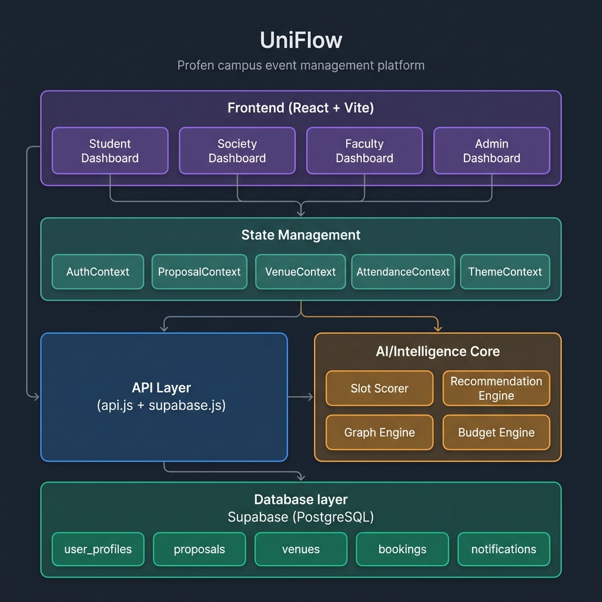
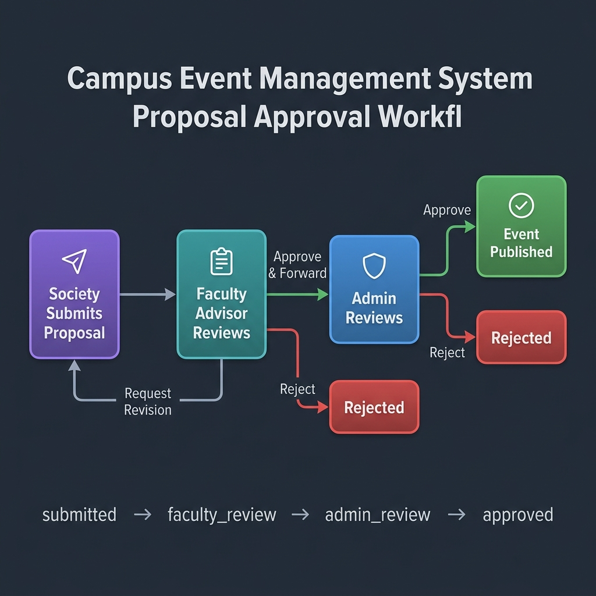

# UniFlow — Campus Operations & Event Management

UniFlow (formerly CampusBook) is a comprehensive role-based platform designed to digitize and streamline campus operations. Initially focused on campus-wide venue booking and event proposal processing, it connects Students, Societies, Faculty Advisors, and Administrators into a single seamless, reactive ecosystem.



## 🚀 Key Features

*   **Role-Based Dashboards**: Tailored interfaces and permission boundaries for Students, Societies, Faculty Advisors, and Admins.
*   **Predictive Operations**: Built-in intelligence for venue clash detection and optimized time-slot suggestions.
*   **End-to-End Proposal Routing**: Fully digital proposal workflow mapped directly to the campus hierarchy.
*   **Live Attendance & Reputation**: Gamified campus engagement tracking via QR scanning.
*   **Supabase Backend**: Real-time subscriptions, secure auth, and robust relational data management using PostgreSQL.

---

## 🏛️ Architecture

UniFlow follows a modular, state-driven architecture built on top of React Contexts to manage discrete operational domains.

### Frontend Layer
Built with **React + Vite**. The UI uses CSS Variables for a modern, fluid dark-mode default design, enforcing high contrast and a premium SaaS aesthetic.

### State Management (The "Engines")
*   `AuthContext`: Top-level gatekeeper. Normalizes user roles and manages session profiles.
*   `ProposalContext`: The workhorse. Manages the lifecycle of event submissions, routing logic, and timeline audits.
*   `VenueContext`: Handles spatial data, availability state, and booking manifestations.
*   `AttendanceContext`: Manages live QR sessions and translates scan volumes into society reputation metrics.

### AI & Intelligence Modules
*   `slotScorer.js`: Evaluates potential event time slots against historical traffic and venue utilization to suggest optimal booking windows.
*   `conflictEngine.js`: Hard-stops double bookings and spatial overlaps.
*   `recommendationEngine.js`: Surfaces relevant upcoming events to students based on dynamic tag and category matching.

---

## 🔄 The Proposal Workflow

UniFlow eliminates paper trailing. The proposal lifecycle is strictly enforced through relational state management:



1.  **Society Submission**: A society fills out event details (date, time, venue, description, poster). The system checks for venue conflicts dynamically.
2.  **Faculty Routing**: Upon submission, the proposal is automatically routed to the society's specific **Faculty Advisor** (resolved via the `user_profiles` relation).
3.  **Faculty Review**: The advisor reviews the submission. They can **Request Revision**, **Reject**, or **Approve & Forward**. If forwarding, a dropdown populates with Admin targets.
4.  **Admin Finalization**: The selected Admin executes final review. Upon approval, the system fires off a `bookVenue` action, officially allocating the space and publishing the event for Students to see.

---

## 🛠️ Technology Stack

*   **Framework**: React 18, Vite
*   **Styling**: Pure CSS (Variables, Flexbox, Grid), Lucide React (Icons)
*   **Charting**: Recharts
*   **Backend as a Service (BaaS)**: Supabase (PostgreSQL, GoTrue Auth)
*   **Routing**: React Router DOM v7

## 🚀 Getting Started

### Prerequisites
*   Node.js (v18+)
*   A Supabase Project

### Installation

1.  **Clone the repository:**
    ```bash
    git clone https://github.com/AnushreeJ13/CampusBook.git
    cd CampusBook
    ```

2.  **Install dependencies:**
    ```bash
    npm install
    ```

3.  **Environment Setup:**
    Create a `.env.local` file in the root directory and add your Supabase credentials:
    ```env
    VITE_SUPABASE_URL=your_supabase_project_url
    VITE_SUPABASE_ANON_KEY=your_supabase_anon_key
    ```

4.  **Run the application locally:**
    ```bash
    npm run dev
    ```

## 🗄️ Database Schema Overview

The Supabase PostgreSQL database revolves around the following core tables:

*   `user_profiles`: Extends the default auth.users. Stores `role`, `college`, `faculty_advisor_id`, and `assigned_clubs`.
*   `proposals`: The central nervous system. Tracks `status`, `current_reviewer`, `venueId`, and the detailed `auditTrail` JSON object.
*   `venues`: Spatial metadata and operational constraints.
*   `bookings`: The immutable manifestation of approved proposals.

---
*Built for modern campus operations.*
